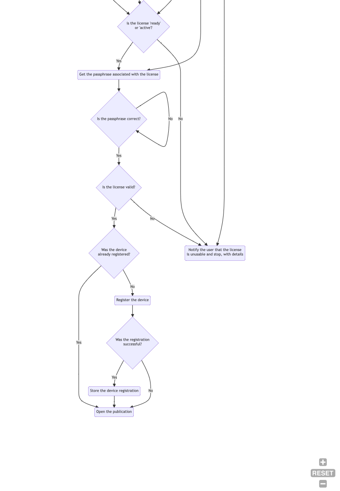

# Import a DRM license
An app which imports a DRM license must follow these steps:

## 1/ Check the license structure

Validate the structure of the license against the LCP [license JSON schema]({{site.url}}/schema/license.schema.json). If the license is invalid, the user gets a notification like "This Readium LCP license is invalid, the publication cannot be processed". 

## 2/ Extract the "publication" link from the license

In the license, the link with a rel attribute equal to "publication" points to the encrypted publication. 

## 3/ Fetch the encrypted publication

The encrypted publication can be downloaded freely. No authentication is required, as the file is AES-256 encrypted and a hacker has no way to know which is its decryption key.

## 4/ Insert the license into the publication

If the encrypted publiction is an EPUB file or Readium Package, the license is inserted to the package, as "license.lcpl". In case of error, the user is notified and the app stops there.

The app can now open the newly generated protected publication.

# Import a protected publication

When an EPUB file is imported, the mimetype (value application/epub+zip) is checked and mandatory metadata are extracted. There is no additional test when the publication is protected by the LCP DRM.

LCP protected PDF, Audiobooks and Divina publications are also imported with no specific checking.  

# Open a protected publication

## 1/ Check if the LCP protected publication is well-formed

An LCP protected publication is signaled by the presence of a license document (license.lcpl). 

In the EPUB use-case it is also signaled by specific values in META-INF/encryption.xml, which indicate which resources are encrypted and with which algorthm. The app must raise an error if license.lcpl is missing but the content is declared encrypted. Also, the app should check that all resources referenced in encryption.xml are found in the EPUB archive.

An app which opens an EPUB protected by LCP (i.e. containing its license) must follow these steps:

## 2/ Validate the license structure

The app must validate the license structure against the JSON schema. If the license is invalid, the user gets a notification like "This Readium LCP license is invalid, the publication cannot be processed". 

## 3/ Fetch the status document

An LCP license may contain a "status" link, i.e. a link to a status document. If it is the case and if the app is online, the app must:

1/ Fetch the status document.

If the Status Document is unavailable or if the client is unable to obtain an internet connection, it MUST NOT block the user from accessing the Publication tied to the License Document. Jump to step 6.

2/ Validate the structure of the status document against the [status document JSON schema]({{site.url}}/schema/status.schema.json). If the structure is not valid, the app must jump to step 6, as if no status link was present in the license. 

## 4/ Fetch an fresh license if needed

If the license timestamp in the 'updated' object of the Status Document is more recent than the timestamp contained in the local copy of the License Document, the app must try to download the License Document again. 

If the download of the fresh License Document does not succeed, log that information and jump to step 5.

The app must then validate the new license structure against the JSON schema. If the fresh license is ok, the app replaces the previous copy with the new one. If not, it logs that the update of the License Document failed.

Note: if the user passphrase has been modified server side after the initial license has been generated, the fresh license is generated with the new passphrase. 

## 5/ Check the license status

Check the status in the status document. If it is "revoked", "returned", "cancelled" or "expired" the app MUST then notify the user and stop there.

Note: the status takes precedence over the content of the obsolete license. 

The message to the user must be clear about the status of the license: e.g. don't display "expired" if the status is "revoked". 

The end date-time corresponding to an expired status should be displayed (e.g. "The license expired on 01 January 2018"); this information is found in the license.

If the license has been revoked, the user message should display the number of devices which registered to the server. This count can be calculated from the number of "register" events in the status document. If no event is logged in the status document, no such message should appear (certainly not "The license was registered by 0 devices"). 

## 6/ Get the passphrase associated with the license

Each LCP license is associated with a passphrase. Providers usually provide the same passphrase for all licenses issued to the same user, but this is not a MUST (this is a SHOULD): a provider may for instance decide to use one passphrase per ebook collection or per user subscription. The passphrase may be changed from time to time, usually at the request of the user. In such a case, every license generated by the provider for the user will usually be updated to handle the new passphrase, but this not required by the specification.    

The app must therefore do the following:

a/ If the user id has been indicated in the license (it is highly recommended but not required), check if one or more passphrase hash associated with licenses from the same user (by origin + user id) have been stored. If one or more values are found, call the lcp library (C++) with the json license and the array of passphrase hash as parameters. The lib returns the correct passphrase, if any, or an error if none is correct. If ok jump to step 7.

b/ Check if a passphrase hash has already been stored for the license. If yes, the app calls the lcp library (C++) with the json license and the passphrase hash as parameters. The lib returns the passphrase hash if it can decrypt the license key_check, or an error if the passphrase is incorrect. If ok jump to step 7.

c/ Display the hint and ask the passphrase to the user. The app the calls the lcp library (C++) with the license and the passphrase hash as parameters. The lib returns the passphrase hash if it can decrypt the license key_check, or an error if the passphrase is incorrect. Loop until the user enters the correct passphrase or quits. 

If the user has entered a good passphrase for the license, store the (license id, origin, user id, passphrase hash) tuple. It will allow later for checks a/ and b/. Note that a record will only be created when the user enters a new passphrase, meaning that this storage cannot be used as a catalog of all licenses acquired by the user.  

Note also that the hash algorithm may depend on the LCP profile used in the license; therefore an evolution of the lib could calculate the hash value from the clear passphrase.

## 7/ Validate the integrity of the license

1/ Check that the profile identifier found in the license can be processed. If it is not the case, the user gets a notification like "This Readium LCP license has a profile identifier that this app cannot handle, the publication cannot be processed".

2/ Call the lcp library (createContext()) with the license, the passphrase hash and CRL as parameters.

The lcp library verifies the license integrity, i.e.:

* checks the signature of the provider certificate using the embedded root certificate;
* checks that the provider certificate is not in the CRL; 
* checks that the provider certificate was not expired when the license was last updated;
* validate the signature of the license;
* checks the user key;
* checks the start/end rights; start/end date-time are compared with the system datetime.

This library returns a "context" structure, to be used later in decryption calls.

See the Readium LCP spec section 5.5 for additional details. 

If the start date-time has not been readed, the license is considered "not usable until ...".
If the end date-time has been reached, it is considered "expired".   

## 8/ Register the device / license 

If the app is online, a Status Document was fetched and it contains a "register" link, the app must silently (= non-blocking for the user):

1/ check if the device / license has already been registered. If it is the case, jump to step 9. 

2/ call the "register" link associated with the license id, passing a device id and device name as parameters. In case of error, the app must let the user read the publication, i.e. jump to step 9. 

3/ If the registration was successful, store the fact that the device / license has been registered.

## 9/ Open the publication 

For each encrypted resource or chunk, the app will call lcp lib (C++), passing the context previously initialized and the encrypted content as parameters.

# Illustration

# Check the print & copy rights

Each time the user decides to print a page or copy a range of characters, the app will 

1/ check the current counter vs the corresponding right. The app will verify that the stored counter plus the additional volume to be printed or copied does not exceed the rights expressed in the license. 

2/ store the new counter