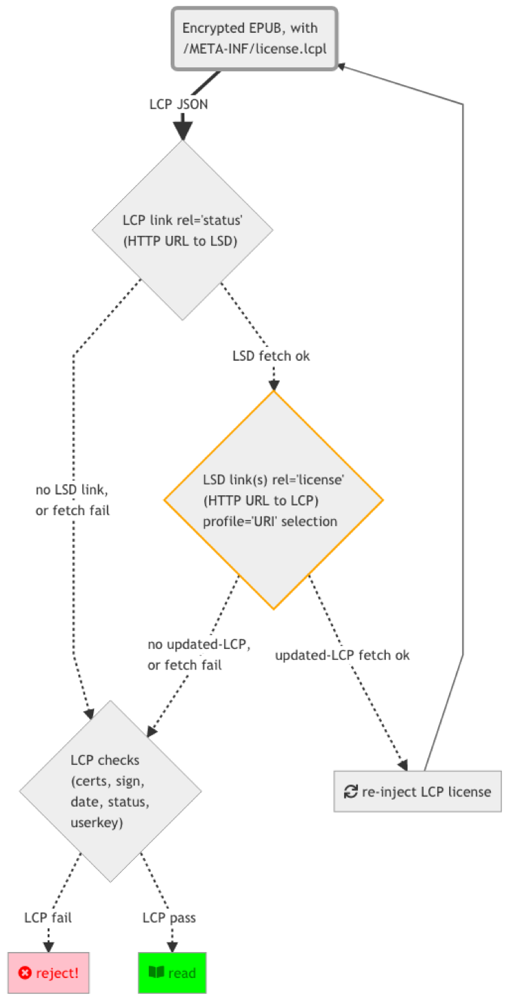

# Readium LCP Profile Upgrade - Technical solution

*December 2018*

Contributors: 
Laurent Le Meur (EDRLab),
Daniel Weck (EDRLab),
Hadrien Gardeur (De Marque),
Rémi Bauzac (Vivlio),
Stefaan Nemegger (ePagine),
Jean-Philippe Bougie (De Marque),

## Summary
This document describes a mechanism for seamlessly transitioning an operational LCP ecosystem to the most recent profile revision, whilst ensuring forward compatibility for outdated client software, and for non-updatable user devices.

The rationale for switching to a new LCP profile is beyond the scope of this document. For illustration purposes: the most obvious motivation for such significant upgrade would be to stop the potential abuse of leaked / reverse-engineered sensitive crypto information (i.e. a response to illegitimate removal of content protection, known as “de-DRM”). Another hypothetical reason for creating an updated LCP profile would be to adopt the latest cryptographic industry standards, in order to protect the integrity of the LCP ecosystem in the long run.

## Overview
An upgraded LCP profile may consist in new provider certificates, different cypher algorithms, modified confidential cryptographic material, etc. Updated content servers that support the latest LCP profile must continue, at least during a reasonable transitional phase, to service outdated clients that are only compliant with the previous / legacy profile(s).

The proposed solution consists in distributing content licenses using the legacy profile, whilst advertising the existence of a newer profile via an additional HTTP link (pointing to the upgraded LCP license) in the LSD (License Status Document) JSON payload. A slightly modified version of the existing LSD (2018) update protocol is then used on the client side to ensure that the “old” license gets replaced with one that conforms to the latest supported LCP profile.

The LCP “upgraded profile” HTTP links inside the LSD JSON are semantically-tagged (i.e. the  “license” relationship), they declare the appropriate content type (i.e. application/vnd.readium.lcp.license.v1.0+json), and they explicitly mention the profile URI (e.g. http://readium.org/lcp/profile-2.0). Client apps can discover them and select the newest supported profile revision, then fetch the given HTTP URL to finally replace the original license with the newly-acquired one. As this is part of the regular LSD update protocol, network errors are handled gracefully, and further attempts can occur at a later stage. This is therefore effectively a non-disruptive process, resulting in a seamless user experience (assuming the network latency / timeouts introduced by the additional HTTP request are not significant).

A client app that does not support this “LCP profile upgrade” protocol simply ignores the additional HTTP links in the License Status Document. Conversely, a client app that supports this update mechanism but does not implement the latest advertised LCP profile simply ignores the corresponding “license” links.

## Flow Chart
This activity diagram illustrates the basic steps required to implement the proposed “LCP profile upgrade” via the LSD protocol. A more complete step-by-step example is provided in the next section.

 

## Example
In this example, we suppose that the oldest non-deprecated LCP profile is “1.0” and the newest is “2.0”. 
 
Note: the JSON data is fictitious but nonetheless quite representative of a real-world case. Some JSON properties were truncated to improve legibility (replaced with placeholder UPPER_CASE values).

### 1 - license.lcpl

This license’s JSON file is already downloaded on the client side (injected inside the EPUB at /META-INF/license.lcpl).

This license matches the LCP “1.0” profile (URI http://readium.org/lcp/profile-1.0).

There is a rel=status LSD link (type=application/vnd.readium.license.status.v1.0+json).

```json
{
    "provider": "https://www.lcp-provider.org",
    "id": "LICENSE_ID",
    "issued": "TIMESTAMP_OF_ISSUE",
    "encryption": {
        "profile": "http://readium.org/lcp/profile-1.0",
        "content_key": {
            "algorithm": "http://www.w3.org/2001/04/xmlenc#aes256-cbc",
            "encrypted_value": "BASE64_ENCRYPTED_VALUE"
        },
        "user_key": {
            "algorithm": "http://www.w3.org/2001/04/xmlenc#sha256",
            "text_hint": "The passphrase is my nickname",
            "key_check": "BASE64_KEYCHECK"
        }
    },
    "links": [
        {
            "rel": "hint",
            "href": "https://front.my-server.org"
        },
        {
            "rel": "status",
            "href": "https://lsd.my-server.org/licenses/LICENSE_ID/status",
            "type": "application/vnd.readium.license.status.v1.0+json"
        },
        {
            "rel": "publication",
            "href": "https://front.my-server.org/contents/CONTENT_ID",
            "type": "application/epub+zip",
            "title": "This is the publication title",
            "length": 435037,
            "hash": "SHA256_DIGEST"
        }
    ],
    "user": {
        "id": "USER_ID",
        "email": "BASE64_EMAIL",
        "name": "BASE64_NAME",
        "encrypted": [
            "email",
            "name"
        ]
    },
    "rights": {
        "print": 2,
        "copy": 50,
        "start": "TIMESTAMP_OF_RIGHTS_START",
        "end": "TIMESTAMP_OF_RIGHTS_END"
    },
    "signature": {
        "certificate": "CERT_DATA",
        "value": "BASE64_SIGNATURE",
        "algorithm": "http://www.w3.org/2001/04/xmldsig-more#ecdsa-sha256"
    }
}
```

As per the License Status Document protocol, the client app requests the advertised status document URL. The HTTP response is as follows:

### 2 - status.lsd

This License Status Document is active, and the events history shows that the client app registered successfully.

The LSD updated license timestamp is in the future relative to the above LCP issued timestamp, therefore the client app must fetch the appropriate rel=license link URL in order to replace its outdated EPUB /META-INF/license.lcpl. It will choose the link corresponding to the latest profile it can handle. 

If the client app does not support the “profile upgrade” mechanism (i.e. it has been released before the end of 2018), it simply ignores the profile JSON link property and it fetches the first available license URL in the links array.

If the client app does not find a profile it can handle in the status document (which means it is now obsolete), it must consider that no updated license is available and try opening the publication using the license it has obtained before.  

If the client app supports the profile URI http://readium.org/lcp/profile-2.0, it elects the corresponding JSON link and it downloads the referenced LCP license.

```json
{
    "id": "LICENSE_ID",
    "status": "active",
    "updated": {
        "license": "TIMESTAMP_OF_LICENSE_UPDATED",
        "status": "TIMESTAMP_OF_STATUS_UPDATED"
    },
    "message": "The license is active",
    "links": [
        {
            "rel": "license",
            "href": "https://front.my-server.org/licenses/2018/LICENSE_ID",
            "type": "application/vnd.readium.lcp.license.v1.0+json",
            "profile": "http://readium.org/lcp/profile-1.0"
        },
        {
            "rel": "license",
            "href": "https://front.my-server.org/licenses/2021/LICENSE_ID",
            "type": "application/vnd.readium.lcp.license.v1.0+json",
            "profile": "http://readium.org/lcp/profile-2.0"
        },
        {
            "rel": "register",
            "href": "https://lsd.my-server.org/licenses/LICENSE_ID/register{?id,name}",
            "type": "application/vnd.readium.license.status.v1.0+json",
            "templated": true
        },
        {
            "rel": "return",
            "href": "https://lsd.my-server.org/licenses/LICENSE_ID/return{?id,name}",
            "type": "application/vnd.readium.license.status.v1.0+json",
            "templated": true
        },
        {
            "rel": "renew",
            "href": "https://lsd.my-server.org/licenses/LICENSE_ID/renew{?end,id,name}",
            "type": "application/vnd.readium.license.status.v1.0+json",
            "templated": true
        }
    ],
    "potential_rights": {
        "end": "TIMESTAMP_OF_POTENTIAL_RIGHTS_END"
    },
    "events": [
        {
            "name": "The vendor app",
            "timestamp": "TIMESTAMP_OF_REGISTER",
            "type": "register",
            "id": "APP_ID"
        }
    ]
}
```

The client app now has the updated EPUB /META-INF/license.lcpl, as follows:

### 3 - license.lcpl (LSD-updated)

This LCP license is now for the “2.0” profile (URI http://readium.org/lcp/profile-2.0).

There is still a rel=status LSD link.

```json
{
    ...
    "issued": "NEW_TIMESTAMP_OF_ISSUE",
    "encryption": {
        "profile": "http://readium.org/lcp/profile-2.0",
        ...
    },
    "links": [
        {
            "rel": "status",
            "href": "https://lsd.my-server.org/licenses/LICENSE_ID/status",
            "type": "application/vnd.readium.license.status.v1.0+json"
        },
        ...
    ],
    ...
}
```

Because of the transition from LCP profile “1.0” to “2.0”, the client app may fail to decrypt the publication using the stored/saved hashed user passphrase. Should this be the case, this triggers a code path that acquires the user passphrase once again via a simple user interface prompt (or, in more sophisticated portal systems where the user is logged-in: more transparently via a credentials server). The new user-key can now decrypt the content-key, and access to the publication content is resumed.

Note that a transition to such LCP profile “2.0” may involve changes in cypher algorithms (which would be duly advertised in the license JSON via well-defined URIs), in addition to potential underlying changes in the secret routine that constructs the user-key from the user-passphrase. At any rate, the process described above still applies.

## Lifetime of LCP profiles

The goal of this work is the long-term preservation of the LCP DRM against hacks. Once the secret crypto material that is at the core of a given profile has been discovered, a person who possesses protected publications and their corresponding passphrases can decipher the content protected using this profile, therefore the profile must be updated, and the old profile deprecated after some time. 

LCP profile updates (which are part of the LCP Compliance Rules) are planned in the LCP Terms of Use, and LCP Solution Providers are required to apply the following: 

_APPLY MANDATORY UPDATES_

_When EDRLab delivers an update of the Readium LCP Compliance Rules to Solution Providers, they shall apply such update and discontinue_

* _Providing to their users previous versions of Readium LCP Compliant Reading Systems_
* _Using Readium LCP License Servers_

_that have not been updated, as soon as reasonably possible and shall provide notice to EDRLab if this will take more than 90 calendar days.
The Solution Provider is required to comply with such changes no later than six (6) months after the date the changes were posted._

An issue is the extended lifetime of hardware reading devices. Many consider that the usual lifetime of such device is 6 years, and that the software of these devices is not updated after the first three years. 

We’ll therefore consider that LCP profile updates must not be frequent, and that a profile can only be deprecated 6 years after its launch. 

For instance, the “1.0” profile has been released in 2018. We may release a “2.0” profile in 2021 and a “3.0” profile in 2024. In 2024, the “1.0” profile will become obsolete and any reading system which is still only compliant with the “1.0” profile will only be able to open saved ebooks and licenses, but will not be able to fetch “1.0” licenses from LCP servers anymore. 

Servers are easier to update than reading systems. A given reading system will only have to support two profiles: the latest at the time of its release, and the previous one (to accomodate licenses served from non-updated servers).

After a profile has been deprecated, a reading system which is only able to read such deprecated profile will still be able to process protected EPUB files containing a licenses of deprecated profile, as per the processing model described above. Therefore, a use who has bought an ebook and has saved it locally will be able to read it without any limit of time. 

The only limitation is that such “deprecated” reading system will not be able to read newer licenses. This may be a surprise for a user who has both a new reading system and a “deprecated” reading system and who exports a protected ebook from his new reading system (with an up-to-date profile) for importing it in his old one: this ebook will not be processable by the “deprecated” reading system. A clear error message should appear in this case to the user, but this is beyond the scope of our specification.   

## Implementations

### Readium “1” clients
At the time of writing this proposal, the Readium “1” codebase (i.e. readium-sdk + readium-lcp-client) does not yet support the use-case of a client app handling multiple LCP profiles. This limitation is mostly due to how demo apps (e.g. SDKLauncher-iOS and SDKLauncher-Android) bundle the profile certificates, and how this gets integrated into the underlying LCP native library. 

This codebase will therefore need to be seriously modified before this feature is implemented. No date can be given at this point. 

### Readium “2” clients

The Readium “2” codebase involves another - simpler - architecture. The code can easily switch to the correct crypto material for the active profile when performing LCP tasks.

However, the proposed mechanism to discover and fetch a new license (upgraded profile) from an old license (legacy profile) must be implemented in platform-specific code for each target application, based upon the existing LSD process (notably, graceful degradation in case of network errors).

This codebase will evolve in Q2 2020.

### Go server(s)

#### License Server

The overarching principle described in this document implicitly considers that encrypted publications do not need to be updated when a new LCP profile is deployed (i.e. no need to create and store expensive publication duplicates because of a “content key” change). Instead, only the emitted licenses need to cater for the differences in legacy and upgraded profiles (typically, “user key” changes). LCP server implementations must expose additional HTTP “routes” so that client apps can request licenses with all the supported profiles (as shown in the above example, an upgraded LCP license can be served on a different URL path indicating the profile name).

This codebase will evolve in Q3 2020.

#### Status Document Server

The server that issues License Status Documents must now be capable of generating multiple license links, one for each LCP profile. The order of links inside the JSON array does matter, in the sense that the first license will be fetched by legacy client implementations that do not handle multiple choices. However, up-to-date client implementations will discriminate links based on their profile URI property, so the ordering of supplemental links does not matter.

This codebase will evolve in Q3 2020.


## Who was involved in this project

The following EDRLab team members and several members of the association are involved in this project:

* Laurent Le Meur: CTO of EDRLab, involved in every EDRLab project, including Readium LCP, Readium Mobile, Readium Desktop, Readium Web, Web Publications.
* Daniel Weck: senior developer at EDRLab; working on Readium LCP, Readium Mobile, Readium Desktop, Readium Web.
* Hadrien Gardeur: CEO of Feedbooks, a French distributor of EPUB ebooks and developer of mobile reading applications; co-editor of the LCP specification and implementer of Readium LCP.
* Rémi Bauzac: CTO of TEA (The Ebook Alternative), a French solution provider for the publishing industry and member of EDRLab; implementer of Readium LCP.
* Stefaan Nemegger: lead developer at ePagine, a French solution provider for the publishing industry and member of EDRLab; implementer of Readium LCP.


